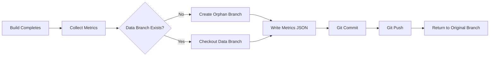

# Git Permissions & Storage

## How Bundle Watch Pushes Data

Bundle Watch stores historical metrics in a **separate Git branch** called `bundlewatch-data`. This approach:

✅ **Pros:**
- No external database required
- Version controlled and auditable
- Works with existing Git workflows
- Free and self-hosted

❌ **Cons:**
- Requires push permissions
- Needs proper CI configuration

---

## Permission Model

### Local Development
**It just works!** Bundle Watch uses your existing Git credentials:
- SSH keys (`~/.ssh/id_rsa`, `~/.ssh/id_ed25519`)
- Git credential helper (username/password, tokens)
- Whatever `git push` would normally use

```bash
# If this works:
git push origin main

# Then this will work too:
pnpm build # (with bundlewatch enabled)
```

### CI/CD (GitHub Actions)

By default, GitHub Actions has **read-only** access. You need to grant write permissions.

#### Option 1: Use `GITHUB_TOKEN` (Recommended)

```yaml
# .github/workflows/ci.yml
name: CI

on: [push, pull_request]

permissions:
  contents: write  # ⚠️ Required for bundlewatch to push

jobs:
  build:
    runs-on: ubuntu-latest
    steps:
      - uses: actions/checkout@v4
        with:
          fetch-depth: 0  # Fetch all history for git storage
      
      - name: Setup Node.js
        uses: actions/setup-node@v4
        with:
          node-version: '24'
      
      - name: Install pnpm
        uses: pnpm/action-setup@v2
      
      - name: Install dependencies
        run: pnpm install
      
      - name: Build with Bundle Watch
        run: pnpm build
        env:
          # GITHUB_TOKEN is automatically available
          # It now has write access due to permissions: contents: write
```

#### Option 2: Use Personal Access Token (PAT)

For more control or organization-level repos:

1. Create a PAT: https://github.com/settings/tokens
   - Scopes needed: `repo` (full control)
2. Add to repo secrets: `Settings > Secrets > Actions > New repository secret`
   - Name: `BUNDLE_WATCH_TOKEN`
3. Use in workflow:

```yaml
- name: Configure Git
  run: |
    git config user.name "Bundle Watch Bot"
    git config user.email "bot@bundlewatch.dev"
    git remote set-url origin https://x-access-token:${{ secrets.BUNDLE_WATCH_TOKEN }}@github.com/${{ github.repository }}.git

- name: Build with Bundle Watch
  run: pnpm build
```

---

## How The Data Branch Works

### Branch Structure

```
bundlewatch-data/
├── main/
│   ├── latest.json          # Most recent metrics for main branch
│   └── abc123def.json       # Metrics for commit abc123def
├── feature-x/
│   ├── latest.json
│   └── 456789abc.json
└── README.md                # Auto-generated index
```

### Storage Flow



### What Gets Pushed

```bash
# Example commit on bundlewatch-data branch:
commit abc123def456789
Author: Bundle Watch <bot@bundlewatch.dev>
Date:   Sun Nov 2 2025 12:34:56

    Add metrics for feature-x@a1b2c3d

    Files changed:
    feature-x/latest.json      | 45 +++++++++++++++++++++
    feature-x/a1b2c3d.json     | 45 +++++++++++++++++++++
```

---

## Security Considerations

### ⚠️ What This Means

**Bundle Watch can push to your repo** if:
1. You enable `saveToGit: true` in config
2. Git credentials are available (locally or in CI)

### 🔒 Safety Measures

1. **Separate Branch**: Only touches `bundlewatch-data`, never your code branches
2. **Opt-in**: Disabled by default (`saveToGit: false`)
3. **Audit Trail**: All changes are version controlled
4. **No Code Access**: The data branch is orphaned (no shared history)

### 🎯 Best Practices

```typescript
// vite.config.ts
export default defineConfig({
  plugins: [
    bundleWatch({
      // ✅ Enable in CI only
      saveToGit: process.env.CI === 'true',
      
      // ✅ Disable locally for development
      // saveToGit: false,
      
      // ✅ Custom branch for testing
      gitBranch: 'bundlewatch-staging',
    }),
  ],
});
```

---

## Alternative: Disable Git Storage

If you don't want to grant push permissions:

```typescript
bundleWatch({
  saveToGit: false,        // Disable git storage
  printReport: true,       // Still get console output
  generateMarkdown: true,  // Generate local markdown file
})
```

You'll lose:
- Historical trend tracking
- Baseline comparison (unless you manually save/load metrics)
- CI integration for PR comments

But you'll keep:
- Bundle analysis
- Size warnings
- Recommendations

---

## Troubleshooting

### "Permission denied (publickey)"

**Cause**: CI doesn't have SSH keys configured

**Fix**: Use HTTPS with token (see Option 2 above)

### "fatal: not a git repository"

**Cause**: Running in non-git directory

**Fix**: Initialize git or disable `saveToGit`

### "refusing to allow a GitHub App to create or update workflow"

**Cause**: `GITHUB_TOKEN` can't modify `.github/workflows/`

**Fix**: This is fine! Bundle Watch only touches the `bundlewatch-data` branch, not workflows.

---

## FAQ

**Q: Does this affect my main branch?**  
A: No. Bundle Watch only pushes to a separate `bundlewatch-data` branch.

**Q: Can I use a different remote?**  
A: Yes! Configure `gitRemote` option:
```typescript
bundleWatch({ gitRemote: 'upstream' })
```

**Q: What if multiple builds run simultaneously?**  
A: Git will handle merge conflicts. The last push wins. Consider using branch-specific names.

**Q: Can I inspect the data manually?**  
A: Absolutely!
```bash
git fetch origin bundlewatch-data
git checkout bundlewatch-data
cat main/latest.json
```

**Q: How do I delete old data?**  
A: Delete the branch and start fresh:
```bash
git push origin --delete bundlewatch-data
```

---

## Summary

Bundle Watch leverages Git as a **free, version-controlled database**. It requires:

1. ✅ Write permissions (same as any `git push`)
2. ✅ CI configuration (just add `permissions: contents: write`)
3. ✅ Trust that it only touches the data branch

It's **secure by design** but requires you to grant explicit permissions in CI environments.

